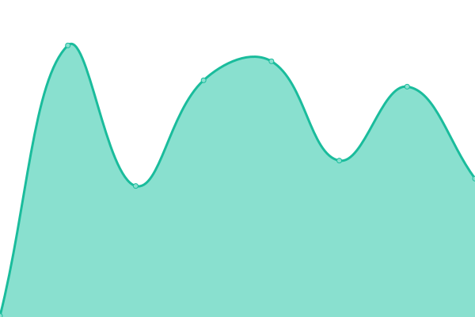
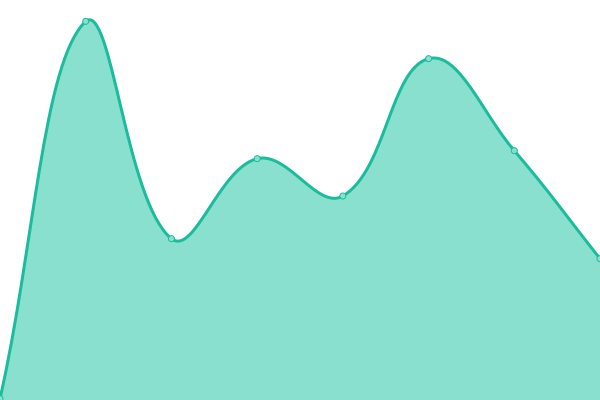
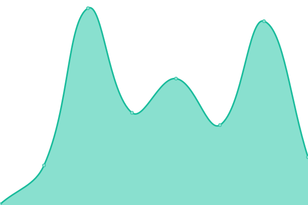

# [📈 Live Status](https://cnbwebmaster.github.io/CNB-Status-Page): <!--live status--> **🟩 All systems operational**

This repository contains the open-source uptime monitor and status page for [cnbwebmaster](https://cnbwebmaster.github.io/CNB-Status-Page), powered by [Upptime](https://github.com/upptime/upptime).

With [Upptime](https://upptime.js.org), you can get your own unlimited and free uptime monitor and status page, powered entirely by a GitHub repository. We use [Issues](https://github.com/cnbwebmaster/CNB-Status-Page/issues) as incident reports, [Actions](https://github.com/cnbwebmaster/CNB-Status-Page/actions) as uptime monitors, and [Pages](https://cnbwebmaster.github.io/CNB-Status-Page) for the status page.

<!--start: status pages-->
<!-- This summary is generated by Upptime (https://github.com/upptime/upptime) -->
<!-- Do not edit this manually, your changes will be overwritten -->
<!-- prettier-ignore -->
| URL | Status | History | Response Time | Uptime |
| --- | ------ | ------- | ------------- | ------ |
|  [Career Now Brands Website](https://careernowbrands.com) | 🟩 Up | [career-now-brands-website.yml](https://github.com/cnbwebmaster/CNB-Status-Page/commits/HEAD/history/career-now-brands-website.yml) | 

 269ms
     
 | 

<a href="https://cnbwebmaster.github.io/CNB-Status-Page/history/career-now-brands-website">100.00%</a>
    

|  [Monday.com](https://monday.com) | 🟩 Up | [monday-com.yml](https://github.com/cnbwebmaster/CNB-Status-Page/commits/HEAD/history/monday-com.yml) | 

 2433ms
     
 | 

<a href="https://cnbwebmaster.github.io/CNB-Status-Page/history/monday-com">100.00%</a>
    

|  [Braze](https://www.braze.com) | 🟩 Up | [braze.yml](https://github.com/cnbwebmaster/CNB-Status-Page/commits/HEAD/history/braze.yml) | 

 542ms
     
 | 

<a href="https://cnbwebmaster.github.io/CNB-Status-Page/history/braze">100.00%</a>
    

|  [Jira (Atlassian)](https://jira.atlassian.com) | 🟩 Up | [jira-atlassian.yml](https://github.com/cnbwebmaster/CNB-Status-Page/commits/HEAD/history/jira-atlassian.yml) | 

 134ms
     
 | 

<a href="https://cnbwebmaster.github.io/CNB-Status-Page/history/jira-atlassian">100.00%</a>
    

|  [Confluence (Atlassian)](https://confluence.atlassian.com) | 🟩 Up | [confluence-atlassian.yml](https://github.com/cnbwebmaster/CNB-Status-Page/commits/HEAD/history/confluence-atlassian.yml) | 

 231ms
     
 | 

<a href="https://cnbwebmaster.github.io/CNB-Status-Page/history/confluence-atlassian">100.00%</a>
    

|  [Tableau Cloud (SSO)](https://sso.online.tableau.com/) | 🟩 Up | [tableau-cloud-sso.yml](https://github.com/cnbwebmaster/CNB-Status-Page/commits/HEAD/history/tableau-cloud-sso.yml) | 

 135ms
     
 | 

<a href="https://cnbwebmaster.github.io/CNB-Status-Page/history/tableau-cloud-sso">100.00%</a>
    

|  [HubSpot](https://app.hubspot.com) | 🟩 Up | [hub-spot.yml](https://github.com/cnbwebmaster/CNB-Status-Page/commits/HEAD/history/hub-spot.yml) | 

 279ms
     
 | 

<a href="https://cnbwebmaster.github.io/CNB-Status-Page/history/hub-spot">100.00%</a>
    

|  [Slack](https://slack.com) | 🟩 Up | [slack.yml](https://github.com/cnbwebmaster/CNB-Status-Page/commits/HEAD/history/slack.yml) | 

 293ms
     
 | 

<a href="https://cnbwebmaster.github.io/CNB-Status-Page/history/slack">100.00%</a>
    

|  [Five9](https://login.five9.com/) | 🟩 Up | [five9.yml](https://github.com/cnbwebmaster/CNB-Status-Page/commits/HEAD/history/five9.yml) | 

 165ms
     
 | 

<a href="https://cnbwebmaster.github.io/CNB-Status-Page/history/five9">100.00%</a>
    

|  [Cloudflare](1.1.1.1) | 🟩 Up | [cloudflare.yml](https://github.com/cnbwebmaster/CNB-Status-Page/commits/HEAD/history/cloudflare.yml) | 

 5ms
     
 | 

<a href="https://cnbwebmaster.github.io/CNB-Status-Page/history/cloudflare">100.00%</a>
    

|  [Google (Connectivity Check)](https://www.google.com) | 🟩 Up | [google-connectivity-check.yml](https://github.com/cnbwebmaster/CNB-Status-Page/commits/HEAD/history/google-connectivity-check.yml) | 

 120ms
     
 | 

<a href="https://cnbwebmaster.github.io/CNB-Status-Page/history/google-connectivity-check">100.00%</a>
    

<!--end: status pages-->

[**Visit our status website →**](https://cnbwebmaster.github.io/CNB-Status-Page)

## 📄 License

- Powered by: [Upptime](https://github.com/upptime/upptime)
- Code: [MIT](./LICENSE) © [Anand Chowdhary](https://anandchowdhary.com), supported by [Pabio](https://pabio.com)
- Data in the `./history` directory: [Open Database License](https://opendatacommons.org/licenses/odbl/1-0/)
